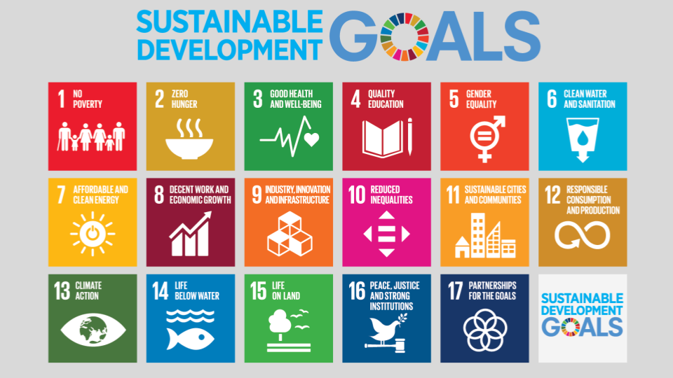
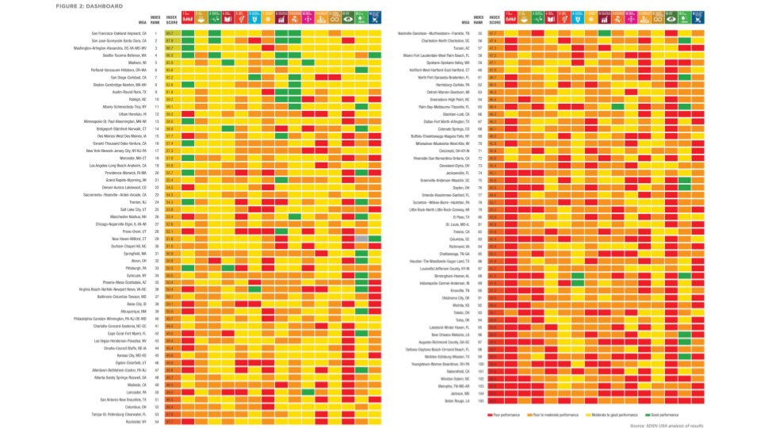
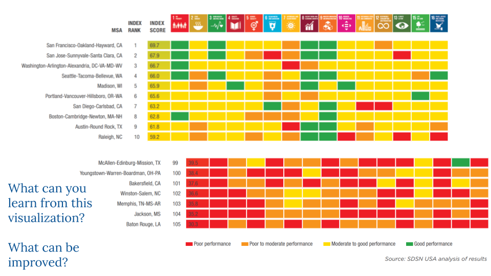
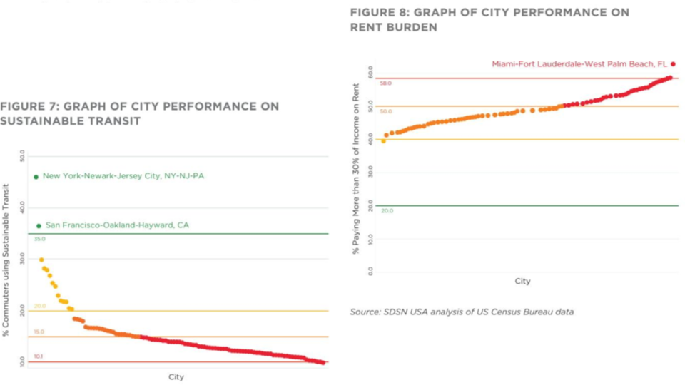

```{r setup, include=FALSE}
knitr::opts_chunk$set(echo = FALSE)
knitr::opts_chunk$set(out.height = "\\textheight",  out.width = "\\textwidth")

library(tidyverse)
library(knitr)

codebook <- read_csv("2019USCitiesIndexResults - Codebook.csv")
results <- read_csv("2019USCitiesIndexResults - Results.csv")
```

The 2019 US Cities Sustainable Development Report was developed in response to rising urbanization in the United States. It is based on the United Nations’ seventeen sustainable development goals that comprehensively outline what a sustainable, equitable city of the future will look like. These goals are to be achieved by 2030. The report takes fifteen of the sustainable goals, assesses various indicators of how close each metropolitan statistical area is to reaching these goals through the creation of target values, averages those indicators to create a goal score, and compares them to the target values.

```{r}

```

For example, goal one is “no poverty”. There are five indicators of poverty used to determine how close a metropolitan statistical area is to exterminating poverty: percentage of population living below the national poverty line, percentage of children living below twice the poverty line, percentage of working poor, whether the state, city and county has a paid sick leave policy, and whether the state, city and county has a paid family/parental leave policy. These indicators are averaged and compared to the target value. This is done for the other fourteen goals with other indicators.

```{r}
results[c(1:5,
             (nrow(results)-5):nrow(results)),
     c("rank_sdgIndex", 
       "maincity", 
       "score_sdgi", 
       paste0(rep("score_sdg",17),1:7))]
```

```{r}
codebook[codebook$SDG==1,c("SDG Alignment",
                           "Indicator name",
                           "Description",
                           "Units",
                           "Min",
                           "Max",
                           "Sort Order",
                           "Target Value",
                           "To Green",
                           "To Yellow",
                           "To Orange",
                           "Worst Value",
                           "Threshold Rationale")]
```


The main visualization of the report was Figure 2: Dashboard. It portrays the relative statuses of US cities toward meeting the UN Sustainable Development Goals. It is successful in that it tells an intuitive story that can be comprehended by anyone. It is reaction-inducing. It also summarizes a variety of data types in a way that can be understood. Unfortunately, it has a story that could also be misinterpreted by individuals. It must be viewed over two pages to be understood because it has a limited color scale that only has a key on the second page. It does not cover every sustainable development goal. Finally, the index scores are not completely clear.

```{r}

```

Because of the choice of the colors, we believe that the objective of this visualization was to elicit an emotional reaction. Based merely on these images, we do not know how bad red is and how good green is, beyond what is shown at the bottom of page 13. Red means poor performance, orange means poor to moderate performance, yellow means moderate to good, and green means good performance. That does not explain what “poor” and “good” mean in this context. Only later is it mentioned that green blocks mean that a metropolitan area has already met the 2030 goals. This tells us that the goal of this chart was not to show technicalities but to elicit an emotional reaction. They could influence a reader’s feelings about the United States’ progress. Policymakers could see the colors and feel motivated to focus on certain blocks and create change. However, these colors could also elicit negative reactions. Individuals might feel bad or apathetic; if the United States’ is so behind on the SDGs, what is the point of trying? With so much red and orange, policymakers might feel angry or even attacked and choose to disregard the SDGs. The visualization of these goals helps to tell the story that the authors are conveying, but it also generalizes the story.

```{r}

```

The story that the authors are trying to tell with this figure is that the United States is failing to achieve many of the Sustainable Development Goals. Every city needs to take much larger steps to reach these goals by 2030. However, looking at the underlying data, while this probably is a good interpretation, there are potentially other ones. For example, the authors used 57 indicators to convey data for the goals. However, the authors also acknowledge that there are potentially hundreds of other indicators that they could have chosen to draw from to create this figure. Perhaps including those other indicators may have led to large changes in the visualization.

```{r}

```


By choosing to show data using four colors and index scores, Figure 2’s authors obscured the complexity of the data that they are pulling from. Some of the data is binary; for example, the existence of a metropolitan government’s paid sick leave policy warrants a 1 and if lacking, warrants a 0. That translates to a score of 100 or 0. Other data, like population with health insurance, is based on percentages, while LGBTQ inclusivity of laws, policies, and services is based on an 0-100 index. These four colors do not capture the diversity of the various measurements. Additionally, the choices of colors make it potentially appear that the United States is doing worse than it is. Yellow means moderate to good, but in this chart, surrounded by red and orange, yellow tends to be ignored by the eye or placed into a negative category, even though it might mean that a city is very close to meeting its goal in one of the yellow blocks. Finally, there is a weighting mechanism underlying the data that is not present in the figure. This can lead to peculiarities. For example, while Honolulu has a higher score than Minneapolis, Minneapolis has more green and yellow blocks than Honolulu. Honolulu has more red and orange ones. This could lead to even greater confusion, particularly for individuals comparing metropolitan areas.

```{r}

```

There are a few better choices for this graphic. One, the graphic should have goals that are easier to read – practically speaking, larger text could be appropriate. The pictures are not necessarily easy to understand. Perhaps yellow could have been split into yellow and light green, to show if a city is actually close to achieving its goals and encouraging readers of this graphic. While this might complicate the graphic, the writers could have subdued the colors and placed numbers over the blocks to show how each metropolitan area scored on each goal. The average of the indicators could be overlaid on the blocks. This could elicit a less emotional reaction and give policymakers clarity on how their cities compare to other cities. Finally, the graphic could be discarded altogether, and a bar chart for each city showing the city average for each goal could be created, with reference to the various indicators that were averaged to create these.

# Reference

Lynch, A., LoPresti, A., Fox, C. (2019): The 2019 US Cities Sustainable Development Report.
New York: Sustainable Development Solutions Network (SDSN).